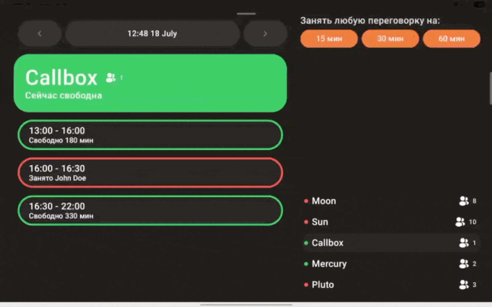

# Effective Office

### Project Goal

Our goal is to make everyday office work simpler and more enjoyable by automating key processes.  

### Technical goal

The main technical task of the project is to create a multi-module Kotlin Multiplatform application, focusing on modern and relevant solutions in this ecosystem. Throughout the project, we tried to minimize the use of other languages and technologies.  

# Apps
## Meeting Room



### Features Overview

| Feature                     | Description                                                  |
|----------------------------|--------------------------------------------------------------|
| Real-time Availability     | Displays up-to-date status of meeting rooms                  |
| Quick Booking              | Instantly reserve an available room with a single tap        |
| Time-Specific Reservations| Book rooms for specific time slots                           |
| Booking Cancellation       | Cancel existing reservations with ease                       |
| Early Room Release         | Free up the room before the end of the reservation           |
| Google Calendar Integration| Syncs all bookings with Google Calendar                      |

## TV App

### Features Overview

| Feature         | Description                                                 |
| --------------- | ----------------------------------------------------------- |
| Stories Display | Shows employee birthdays, anniversaries, new hires, and congratulatory highlights.     |
| Leaderboard     | Displays stats for Duolingo, sports, and internal currency. |
| Events          | Displays upcoming events with QR codes for registration.    |
| Photo Slideshow | Displays corporate photos grouped by albums.                |
| Autoplay        | Automatically switches between screens in a slideshow.      |
| Remote Control  | Allows navigation and interaction using a remote control.   |

## SMS Router

### Features Overview

| Feature               | Description                                                  |
| --------------------- | ------------------------------------------------------------ |
| SMS Interception      | Captures incoming SMS messages.                              |
| Webhook Forwarding    | Sends SMS data to configured webhooks.                       |
| Per-SIM Configuration | Stores webhook settings for each SIM in SharedPreferences.   |
| Delivery Logging      | Logs SMS delivery status in Room database and provides a UI. |
| Settings UI           | Allows configuration of webhook settings for each SIM.       |

## Quick Start

### Prerequisites

- Git
- Docker and Docker Compose
- JDK 17 or higher
- Gitleaks (for development)

### Installation

1. Clone the repository:
   ```bash
   git clone https://github.com/effective-dev-opensource/Effective-Office.git
   cd Effective-Office
   ```

2. Install Git hooks for development:
   ```bash
   ./scripts/install.sh
   ```

3. Configure environment variables:
   ```bash
   cp backend/app/src/main/resources/env.example backend/app/src/main/resources/.env
   ```
   Edit the `.env` file with your configuration.

4. Set up required credentials:
   - Add `google-credentials.json` for Google Calendar API
   - Add `firebase-credentials.json` for Firebase notifications
   - Generate keystore files for Android applications

5. Run the backend (using Docker):
   ```bash
   cd deploy/dev
   docker-compose up -d
   ```

   Or run locally without Docker:
   ```bash
   # Start PostgreSQL
   docker run --name postgres-effectiveoffice -e POSTGRES_DB=effectiveoffice -e POSTGRES_USER=postgres -e POSTGRES_PASSWORD=postgres -p 5432:5432 -d postgres:15-alpine

   # Run the backend
   ./gradlew :backend:app:bootRun --args='--spring.profiles.active=local'
   ```

### Run Clients
1. Open the project in Android Studio or IntelliJ IDEA
2. Sync the Gradle project to download dependencies
3. Choose the appropriate run configuration in IDE
4. Run (Shift+F10 or Control+R)

For detailed installation instructions, including setting up credentials and running client applications, see our [Getting Started Guide](https://github.com/effective-dev-opensource/Effective-Office/wiki/Getting-Started-with-Effective-Office) in the wiki.

### Project Structure

```
effective-office/
├── backend/           # Server-side Spring Boot application with PostgreSQL
├── clients/           # Client applications
│   ├── tablet/        # Meeting Room Tablet App
│   ├── tv/            # Company News & Photos TV App
│   ├── smsrouter/     # Android SMS Router & Webhooks
│   └── shared/        # Shared module for common functionality across clients
├── iosApp/            # iOS tablet application
├── deploy/            # Deployment configurations
│   ├── dev/           # Development environment
│   └── prod/          # Production environment
├── scripts/           # Utility scripts
│   ├── git-hooks/     # Git hooks for development
│   └── install.sh     # Installation script
└── build-logic/       # Build configuration
```

# Documentation

For comprehensive documentation, please visit our [Wiki](https://github.com/effective-dev-opensource/Effective-Office/wiki).

# Contributing

We welcome contributions! Please see our [CONTRIBUTION.md](CONTRIBUTION.md) file for guidelines.

# AI Tools in Development

We actively use [Junie](https://www.jetbrains.com//junie/), the AI coding agent from JetBrains, in the development and refactoring of Effective Office.  
Junie helped us speed up backend initialization, migrate features from legacy code, and generate documentation and boilerplate.  
We continue to use it as part of our workflow, combining automation with careful developer review.

Read more about our experience using Junie in [the Medium article](https://medium.com/effective-developers/how-we-used-junie-by-jetbrains-to-speed-up-development-of-an-internal-project-fc6f151a1f94).

# Authors

- [Alex Korovyansky](https://t.me/alexkorovyansky) 
- [Matvey Avgul](https://t.me/matthewavgul) 
- [Maxim Mishenko](https://github.com/UserNameMax)
- [Tatyana Terleeva](https://t.me/tatyana_terleeva) 
- [Stanislav Radchenko](https://github.com/Radch-enko)
- [Vitaly Smirnov](https://github.com/KrugarValdes)
- [Viktoriya Kokh](https://t.me/the_koheskine)

# License
The code is available as open source under the terms of the [MIT LICENSE](LICENSE).
